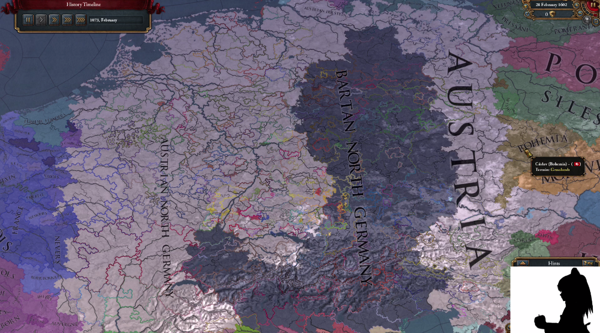

# Rendering Videos on the EU4 Time Line

This repository contains code to create an eu4-savefile that plays back a video in question. Currently only supports Black-And-White Videos.

**Currently only supports a folder of frames. If you have a video, you need to convert it to frames first, e.g.using ffmpeg.**

**Currently only supports Black-White Videos!** (Oof)

Make sure, requirements.txt is satisfied. 

The code executed with the command line:

`python main.py -i <frame_dir> -f1 <first_frame> -o <output_file> -eu4 <base_save_file> --mod_dir <eu4_game_file_dir> -d <definition> -p <province_map> --crop <crop_values> --resize <resize_shape>`

Use the following command to get additional info on the arguments and a list of all available arguments:

`python main.py -h`

----

**frame_dir**: Path to your folder of frames

**first_frame**: name of the first frame (e.g. frame1.jpg). The next frames will be inferred by incrementing the number at the end.

**output_file**: Name and location of the new eu4-savefile. Has to end with ".eu4" (e.g. "./xd.eu4")

**base_save_file**: Provide the path to an eu4-savefile, that is the basis for any modification. A new savefile is recommended

-----
**Either:**

**eu4_game_files_dir**: provide a path to where eu4 is saved, if you are using the base map, otherwise provide a path to the mod.

**Or:**

**province_map**: usually called "provinces.bmp", found under `<PATHTOEU4>/map`. Maps pixel-location to a colour.

**definition**: usually called "definition.csv", found under `<PATHTOEU4>/map`. Maps Colour to Province.

If province_map and definition are provided, they are prioritized. But you have to provide either both or the PATHTOEU4. 

----- 
**crop_values**: LEFT UPPER RIGHT LOWER (e.g. 0 0 60 60); crops the bmp at these bounds in the image. You might need to open the image with sth like GIMP to find good crop values. This way you can specify where on the worldmap the video renders (You can also just crop it yourself and pass the generated new bmp as an argument. Refer to province_map)

**resize_shape**: H W (e.g. 75 100); New height and width values; Rescales of the province map before computation. This speeds up computation, but comes at the cost of more artifacts.

---

